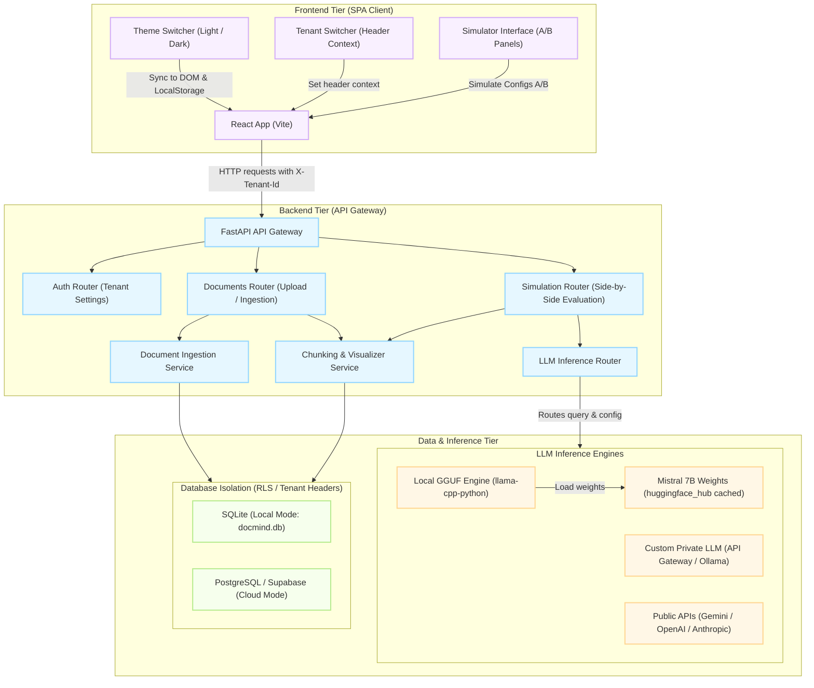

# DocMind Studio - Multi-Tenant RAG Parameter Simulator & Playground

DocMind Studio is a production-ready, 3-tier Proof of Concept (POC) web application designed to evaluate Retrieval-Augmented Generation (RAG) and Large Language Model (LLM) performance parameters side-by-side. 

Prompt engineers and developers can upload text or PDF documents, configure system personas, tweak chunk size, overlap, temperature, and sampling parameters, and execute queries side-by-side to visually evaluate retrieval quality, style, latency, and token consumption.

---

## 🏗️ Technical Architecture & Key Highlights

### Technical Architecture Diagram



### 1. Unified Monorepo Structure
- **Frontend (UI Tier):** React.js (Vite) + Tailwind CSS (v4) + Lucide React + Axios. Built as a responsive, modern Glassmorphic dashboard.
- **Backend (API Tier):** FastAPI (Python 3.10+) + SQLAlchemy + Uvicorn. Clean RESTful API architecture with dependency injection and robust CORS setup.
- **Database (Data Tier):** Hybrid Database Engine. Defaults to a zero-config local SQLite database (`docmind.db` with WAL mode) for local playground testing, and automatically switches to PostgreSQL/Supabase with `pgvector` when `DATABASE_URL` is set.

### 2. Enterprise Multi-Tenancy (Row-Level Security)
Data isolation is enforced at the database level. Each table contains a `tenant_id` column.
- In **Supabase/PostgreSQL**, Row-Level Security (RLS) policies isolate tenant data using the user's JWT metadata (`auth.jwt() -> 'user_metadata' ->> 'tenant_id'`).
- In the **FastAPI Gateway**, the tenant context is derived from the standard HTTP header `X-Tenant-Id` sent by the React application. This ensures strict logical partition and RLS simulation.

### 3. Custom Customer LLM Integration
DocMind Studio supports standard public providers (Gemini, OpenAI, Anthropic) but also allows tenants to configure their own **Custom Customer LLM API Endpoint** (e.g., Ollama, private AWS SageMaker, vLLM, or corporate gateways). When custom LLM is enabled, requests are formatted to OpenAI-compatible payloads and routed securely.

### 4. Hybrid Ingestion & Search Simulation
For SQLite local environments, the backend uses a custom word-overlap Jaccard relevance score combined with exact substring matching to simulate vector retrieval. If deployed on Supabase, it supports PostgreSQL cosine distance vector matching (`<=>` operator via pgvector).

---

## 🚀 Local Run Guide (Developer Setup)

### Option A: Zero-Config Local Setup (Fastest)

#### 1. Start Backend API
```bash
# Navigate to backend directory
cd backend

# Create and activate virtual environment
python3 -m venv venv
source venv/bin/activate

# Install dependencies
pip install -r requirements.txt

# Start the dev server (defaults to port 8000)
uvicorn app.main:app --reload
```
*Note: This automatically initializes `docmind.db` in your backend folder.*

#### 2. Start Frontend Dev Server
```bash
# Navigate to frontend directory
cd frontend

# Install dependencies
npm install

# Start Vite server (defaults to http://localhost:5173)
npm run dev
```

---

### Option B: Docker Compose (Fully Orchestrated)
Make sure you have Docker installed. Spin up both tiers with a single command:
```bash
docker-compose up --build
```
- **Frontend UI:** Access at `http://localhost:8080`
- **Backend API:** Gateway running at `http://localhost:8000`

---

## ☁️ Cloud Deployment & Automation Guides

### 1. Frontend: Netlify
Netlify connects directly to your GitHub repository:
1. Set the Base directory to `frontend`.
2. Build command: `npm run build`.
3. Publish directory: `dist`.
4. Add environment variables:
   - `VITE_API_BASE_URL`: Pointing to your deployed backend API URL.
5. Create a `netlify.toml` in your frontend directory for SPA redirects:
   ```toml
   [[redirects]]
     from = "/*"
     to = "/index.html"
     status = 200
   ```

### 2. Backend: Render / Railway / Fly.io
Deploy the `backend` folder as a Python web service:
1. Environment: `Python 3.10` or higher.
2. Build command: `pip install -r requirements.txt`.
3. Start command: `uvicorn app.main:app --host 0.0.0.0 --port $PORT`.
4. Environment variables to add:
   - `DATABASE_URL`: Connection string to your Supabase PostgreSQL.
   - `GEMINI_API_KEY`, `OPENAI_API_KEY`: Default API keys (fallback options).

### 3. Database: Supabase Setup
Run the script in [schema.sql](file:///Users/sachin/Desktop/Per_data/Pers/ok/git-prj/RAG-Parameter-Explorer/schema.sql) using the Supabase SQL Editor. This initializes tables, creates indexes, and configures Row-Level Security isolation policies for tenants.

---

## ☁️ AWS Cloud Automation Deployment

For enterprise hosting on AWS, we recommend a Dockerized deployment using **AWS App Runner** or **AWS ECS (Fargate)** with **AWS RDS (PostgreSQL)**.

### AWS ECS Fargate Task Definition (JSON Snippet)
```json
{
  "containerDefinitions": [
    {
      "name": "docmind-backend",
      "image": "<YOUR_ACCOUNT_ID>.dkr.ecr.<REGION>.amazonaws.com/docmind-backend:latest",
      "portMappings": [
        {
          "containerPort": 8000,
          "hostPort": 8000
        }
      ],
      "environment": [
        { "name": "DATABASE_URL", "value": "postgresql://<RDS_ENDPOINT>:5432/docmind" }
      ],
      "logConfiguration": {
        "logDriver": "awslogs",
        "options": {
          "awslogs-group": "/ecs/docmind",
          "awslogs-region": "us-east-1",
          "awslogs-stream-prefix": "backend"
        }
      }
    }
  ],
  "family": "docmind-service",
  "networkMode": "awsvpc",
  "requiresCompatibilities": [
    "FARGATE"
  ],
  "cpu": "512",
  "memory": "1024"
}
```

### Automation Script: AWS Deployment (`deploy_aws.sh`)
You can use the following snippet to automate pushing the backend image to AWS ECR:
```bash
#!/usr/bin/env bash
AWS_REGION="us-east-1"
ACCOUNT_ID="123456789012"
REPO_NAME="docmind-backend"

# Login to AWS ECR
aws ecr get-login-password --region $AWS_REGION | docker login --username AWS --password-stdin $ACCOUNT_ID.dkr.ecr.$AWS_REGION.amazonaws.com

# Create Repository if it doesn't exist
aws ecr create-repository --repository-name $REPO_NAME --region $AWS_REGION || true

# Build and Push
docker build -t $REPO_NAME ./backend
docker tag $REPO_NAME:latest $ACCOUNT_ID.dkr.ecr.$AWS_REGION.amazonaws.com/$REPO_NAME:latest
docker push $ACCOUNT_ID.dkr.ecr.$AWS_REGION.amazonaws.com/$REPO_NAME:latest
```
