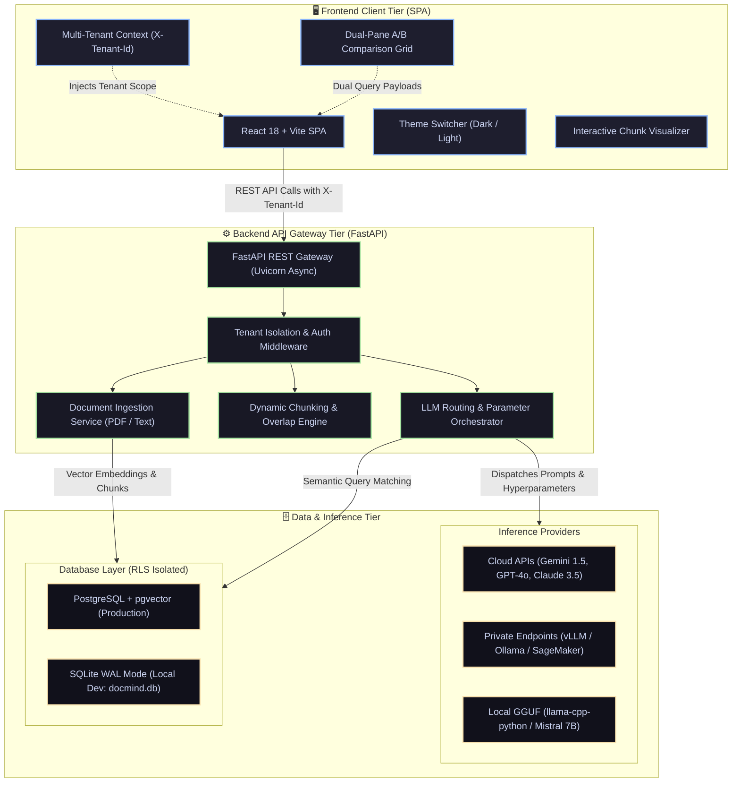

<div align="center">

# 🧠 DocMind Studio: Enterprise Multi-Tenant RAG & LLM Parameter Simulator

### Production-Ready 3-Tier Evaluation Playground for Retrieval-Augmented Generation & Prompt Engineering

[](https://fastapi.tiangolo.com/)
[](https://reactjs.org/)
[](https://www.python.org/)
[](https://www.typescriptlang.org/)
[](https://www.docker.com/)
[](https://supabase.com/)
[](https://tailwindcss.com/)
[](https://opensource.org/licenses/MIT)

<p align="center">
  <b>Evaluate RAG pipelines, chunking strategies, and LLM hyperparameters side-by-side with real-time token, latency, and quality telemetry.</b>
</p>

</div>

---

## 📌 Executive Overview

**DocMind Studio** is an enterprise-grade, 3-tier architectural playground engineered to solve the core challenge of production RAG: **predictable, cost-effective, and accurate LLM response generation**.

Prompt engineers, AI architects, and developers can upload unstructured PDFs and text, configure dynamic multi-tenant personas, fine-tune chunk sizes (128–2048) and overlap (0–500), calibrate sampling parameters (Temperature, Top-P, Frequency Penalty), and execute dual A/B test queries side-by-side.

### 🌟 Key Capabilities
- ⚖️ **Side-by-Side A/B Simulation**: Compare Model A vs. Model B (or Chunk Strategy A vs. Chunk Strategy B) concurrently.
- 🏢 **Zero-Trust Multi-Tenancy**: Logical database isolation backed by PostgreSQL Row-Level Security (RLS) policies and context propagation via `X-Tenant-Id`.
- 🔌 **Hybrid LLM Gateway**: Seamlessly routes across public foundation models (Google Gemini, OpenAI, Anthropic), self-hosted private models (Ollama, vLLM, AWS SageMaker), and local embedded GGUF weights via `llama-cpp-python`.
- 🔍 **Dual Vector & Semantic Retrieval**: Native `pgvector` cosine similarity (`<=>`) in production with automatic fallback to Jaccard-overlap search in lightweight SQLite dev environments.
- 📊 **Real-Time Telemetry**: Immediate visibility into token consumption, inference latency (TTFT), retrieval scores, and cost attribution.

---

## 🏛️ Enterprise System Architecture


```mermaid
flowchart TB
    %% Client Tier
    subgraph ClientTier ["🖥️ Frontend Client Tier (SPA)"]
        direction TB
        ReactApp["React 18 + Vite SPA"]
        ThemeContext["Theme Switcher (Dark / Light)"]
        TenantContext["Multi-Tenant Context (X-Tenant-Id)"]
        SimEngine["Dual-Pane A/B Comparison Grid"]
        ChunkViewer["Interactive Chunk Visualizer"]
    end

    %% API Gateway Tier
    subgraph APITier ["⚙️ Backend API Gateway Tier (FastAPI)"]
        direction TB
        FastAPIGw["FastAPI REST Gateway (Uvicorn Async)"]
        AuthMiddleware["Tenant Isolation & Auth Middleware"]
        DocIngestSvc["Document Ingestion Service (PDF / Text)"]
        ChunkingEngine["Dynamic Chunking & Overlap Engine"]
        InferenceRouter["LLM Routing & Parameter Orchestrator"]
    end

    %% Data & Inference Tier
    subgraph DataTier ["🗄️ Data & Inference Tier"]
        direction TB
        subgraph Storage ["Database Layer (RLS Isolated)"]
            SupabasePG["PostgreSQL + pgvector (Production)"]
            LocalSQLite["SQLite WAL Mode (Local Dev: docmind.db)"]
        end
        subgraph Models ["Inference Providers"]
            CloudLLM["Cloud APIs (Gemini 1.5, GPT-4o, Claude 3.5)"]
            PrivateLLM["Private Endpoints (vLLM / Ollama / SageMaker)"]
            EmbeddedLLM["Local GGUF (llama-cpp-python / Mistral 7B)"]
        end
    end

    %% Interconnections
    ReactApp -->|REST API Calls with X-Tenant-Id| FastAPIGw
    TenantContext -.->|Injects Tenant Scope| ReactApp
    SimEngine -.->|Dual Query Payloads| ReactApp

    FastAPIGw --> AuthMiddleware
    AuthMiddleware --> DocIngestSvc
    AuthMiddleware --> ChunkingEngine
    AuthMiddleware --> InferenceRouter

    DocIngestSvc -->|Vector Embeddings & Chunks| Storage
    InferenceRouter -->|Semantic Query Matching| Storage
    InferenceRouter -->|Dispatches Prompts & Hyperparameters| Models

    classDef clientStyle fill:#1e1e2e,stroke:#89b4fa,stroke-width:2px,color:#cdd6f4;
    classDef apiStyle fill:#181825,stroke:#a6e3a1,stroke-width:2px,color:#cdd6f4;
    classDef dataStyle fill:#11111b,stroke:#f9e2af,stroke-width:2px,color:#cdd6f4;

    class ReactApp,ThemeContext,TenantContext,SimEngine,ChunkViewer clientStyle;
    class FastAPIGw,AuthMiddleware,DocIngestSvc,ChunkingEngine,InferenceRouter apiStyle;
    class SupabasePG,LocalSQLite,CloudLLM,PrivateLLM,EmbeddedLLM dataStyle;
```

---

## 🔬 Core Architectural Pillars

### 1. Enterprise Multi-Tenancy & Row-Level Security (RLS)
Data isolation is strictly enforced at the storage engine level. Each record across documents, chunks, and simulation logs is partitioned by `tenant_id`.
- **PostgreSQL / Supabase**: RLS policies enforce tenant boundary isolation:
  ```sql
  CREATE POLICY tenant_isolation_policy ON documents
  FOR ALL USING (tenant_id = current_setting('request.jwt.claims', true)::json->>'tenant_id');
  ```
- **FastAPI Middleware**: Parses the incoming `X-Tenant-Id` header, binds it to request state, and automatically filters all downstream SQLAlchemy sessions.

### 2. Side-by-Side Parametric Simulation
Evaluate how microscopic adjustments change LLM outputs in real time:
| Parameter | Range | Impact Evaluated |
| :--- | :--- | :--- |
| **Chunk Size** | 128 – 2048 tokens | Context density vs. precision retrieval |
| **Overlap** | 0 – 500 tokens | Context preservation across boundaries |
| **Temperature** | 0.0 – 2.0 | Hallucination rate vs. creative reasoning |
| **Top-P (Nucleus)** | 0.05 – 1.0 | Vocabulary restriction & tail truncation |
| **System Persona** | Dynamic string | Output tone, format compliance, and safety guardrails |

### 3. Unified Ingestion & Hybrid Vector Search
- **PDF & Plaintext Parser**: Extracts textual streams and strips non-semantic artifacts.
- **Production Mode**: Uses high-dimensional vector embeddings with cosine similarity distance search (`<=>` operator via PostgreSQL `pgvector`).
- **Zero-Config Dev Mode**: Automatically falls back to SQLite WAL mode with a normalized Jaccard word-overlap scoring algorithm, allowing instantaneous local testing without external vector databases.

---

## 🚀 Quick Start Guide

### Option 1: Zero-Config Local Setup (Recommended)

#### 1. Backend Service
```bash
cd backend
python3 -m venv venv
source venv/bin/activate
pip install -r requirements.txt
uvicorn app.main:app --reload --port 8000
```
> *API Gateway will initialize with an embedded SQLite database (`docmind.db`) at `http://localhost:8000`.*

#### 2. Frontend Application
```bash
cd frontend
npm install
npm run dev
```
> *Access the visual studio dashboard at `http://localhost:5173`.*

---

### Option 2: Docker Compose (Fully Orchestrated)
Spin up the entire decoupled multi-tier stack with a single command:
```bash
docker-compose up --build
```
- **Frontend UI**: `http://localhost:8080`
- **Backend API Docs**: `http://localhost:8000/docs`

---

## ☁️ Enterprise Production Deployment (AWS ECS Fargate)

DocMind Studio is architected for stateless containerized deployment across AWS:

```
[ Route 53 ] ➔ [ Application Load Balancer ] ➔ [ AWS ECS Fargate ] ➔ [ AWS RDS Aurora PostgreSQL (pgvector) ]
                                                        │
                                                        ▼
                                          [ AWS Secrets Manager ] (API Keys & Credentials)
```

Automated ECR build and push script:
```bash
#!/usr/bin/env bash
set -e
AWS_REGION="us-east-1"
ACCOUNT_ID="123456789012"
REPO_NAME="docmind-backend"

aws ecr get-login-password --region $AWS_REGION | docker login --username AWS --password-stdin $ACCOUNT_ID.dkr.ecr.$AWS_REGION.amazonaws.com
aws ecr create-repository --repository-name $REPO_NAME --region $AWS_REGION || true

docker build -t $REPO_NAME ./backend
docker tag $REPO_NAME:latest $ACCOUNT_ID.dkr.ecr.$AWS_REGION.amazonaws.com/$REPO_NAME:latest
docker push $ACCOUNT_ID.dkr.ecr.$AWS_REGION.amazonaws.com/$REPO_NAME:latest
```

---

## 📂 Repository Structure

```text
RAG-Parameter-Explorer/
├── backend/
│   ├── app/
│   │   ├── api/             # REST Routers (auth, documents, simulation)
│   │   ├── core/            # Config, security, database connectors
│   │   ├── models/          # SQLAlchemy ORM schemas
│   │   └── services/        # Ingestion, chunking visualizer, LLM inference
│   ├── requirements.txt
│   └── Dockerfile
├── frontend/
│   ├── src/
│   │   ├── components/      # Glassmorphic UI, A/B parameter sliders, chunk viewer
│   │   ├── context/         # Theme & Tenant state providers
│   │   └── services/        # Axios API client
│   ├── package.json
│   └── vite.config.js
├── docker-compose.yml
├── schema.sql               # PostgreSQL pgvector & RLS configuration
└── README.md
```

---

## 🤝 Author & Contact

**Sachin Kumar Sharma**  
*Technical Lead & Systems Architect | Agentic AI • LLMs • Distributed Systems*  
- 💼 **LinkedIn**: [linkedin.com/in/sachin-s-67800118](https://www.linkedin.com/in/sachin-s-67800118/)  
- 🌐 **Portfolio**: [sachincredible.com](https://www.sachincredible.com)  
- 📧 **Email**: [sachincredible9@gmail.com](mailto:sachincredible9@gmail.com)  
- 📍 **Location**: Toronto, ON, Canada  
